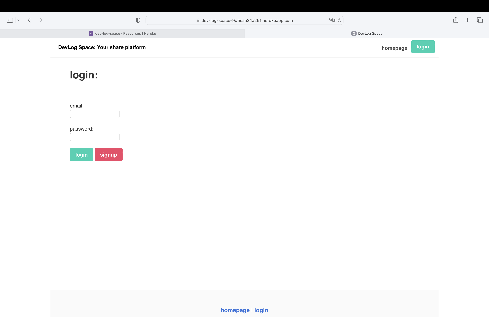

# Dev-Log-Space
A special blog site where developers can publish their blog posts and comment on other developers’ posts as well.

## Requirements
Please note that this app is following the MVC paradigm in its architectural structure. However, you still need to install required packages through your terminal by using this command:
npm i  - or - npm install, and then you will install:

* express - which important for routing.
* express-handlebars - using as the templating language.
* Sequelize as the ORM.
* The express-session npm package for authentication.
* connect-session-sequelize - to initialize sequelize with session store.
* dotenv - loads environment variables from a .env file into process.env .Storing configuration in the environment separate from code.
> **important**: You need to Add a .env file to the root of the project after you download it and type in it:
```text
DB_NAME = 'devblogs_db'
DB_USER = 'root' // your user
DB_PASSWORD = 'XXX' // your password
```

## Contacts:
Please feel free to check my GitHub page: [alaakouki](https://github.com/alaakouki?tab=repositories)

Or for more information or queries, please don't hesitate to send me email to: alaakouki@hotmail.com


## Mock-up
The following images shows Dev-Log-Space webpage appearance for Users on desktop screens:




